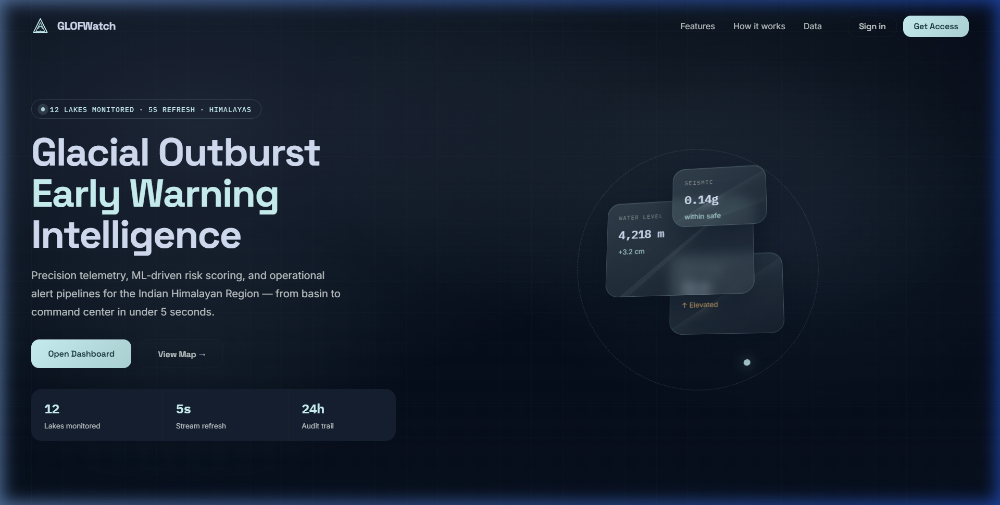
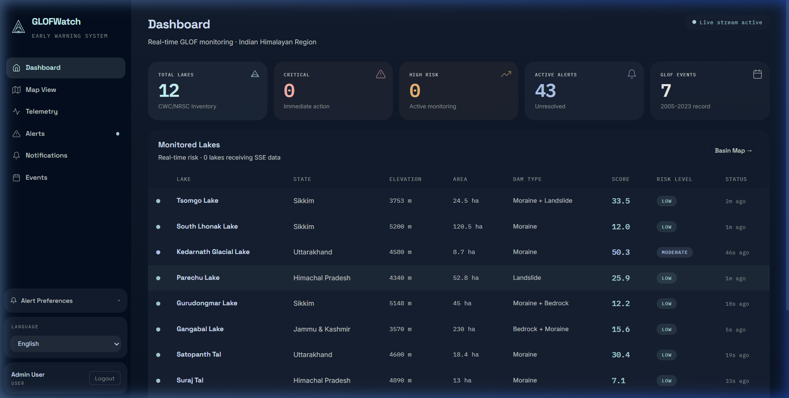
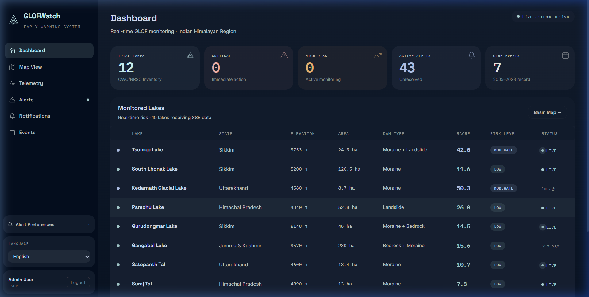
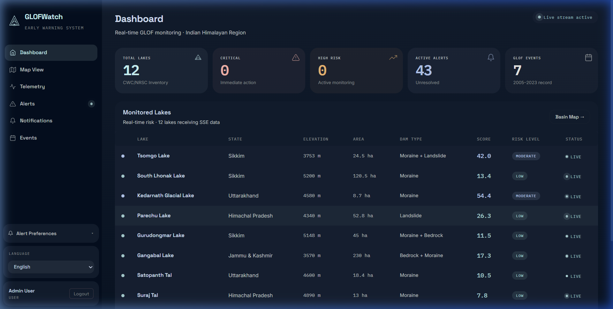

<p align="center">
  
  
  
  
  
  
  
  
  
</p>

# 🏔️ GLOFWatch — Glacial Lake Outburst Flood Early Warning System

> A real-time, full-stack early warning and monitoring system for Glacial Lake Outburst Floods (GLOFs) in the Indian Himalayan Region. Combines live weather telemetry, ML-blended risk scoring, interactive geospatial mapping, and multi-channel alerting to protect downstream communities.

---

## 📑 Table of Contents

- [Abstract](#-abstract)
- [Live Demo & Screenshots](#-live-demo--screenshots)
- [Problem Statement](#-problem-statement)
- [Objectives](#-objectives)
- [Software Requirements Specification (SRS)](#-software-requirements-specification-srs)
- [System Architecture](#-system-architecture)
- [Technology Stack](#-technology-stack)
- [Data Sources](#-data-sources)
- [Database Schema](#-database-schema)
- [Risk Calculation Engine](#-risk-calculation-engine)
- [Machine Learning Pipeline](#-machine-learning-pipeline)
- [Features](#-features)
- [API Reference](#-api-reference)
- [Project Structure](#-project-structure)
- [Getting Started](#-getting-started)
- [Deployment](#-deployment)
- [Testing](#-testing)
- [CI/CD Pipeline](#-cicd-pipeline)
- [Performance Benchmarks](#-performance-benchmarks)
- [Security](#-security)
- [Internationalization (i18n)](#-internationalization-i18n)
- [Comparison with Existing Systems](#-comparison-with-existing-systems)
- [Weekly Progress Reports](#-weekly-progress-reports)
- [UML Diagrams](#-uml-diagrams)
- [Future Scope](#-future-scope)
- [References & Bibliography](#-references--bibliography)
- [Contributing](#-contributing)
- [License](#-license)
- [Authors](#-authors)

---

## 📄 Abstract

Glacial Lake Outburst Floods (GLOFs) are among the most catastrophic natural hazards in high-mountain regions, capable of releasing millions of cubic meters of water within minutes. As climate change accelerates glacial retreat across the Hindu Kush–Himalayan belt, the number and size of glacial lakes is growing rapidly, intensifying downstream risk for communities, infrastructure, and hydroelectric assets.

---

## 🖼️ Live Demo & Screenshots

### 🔗 Live Demo

| Service | URL |
|---------|-----|
| **Frontend (Dashboard)** | [https://glof-frontend.onrender.com](https://glof-frontend.onrender.com) |
| **Backend API** | [https://glof-ews-api.onrender.com](https://glof-ews-api.onrender.com) |
| **Swagger Docs** | [https://glof-ews-api.onrender.com/apidocs](https://glof-ews-api.onrender.com/apidocs) |
| **Health Check** | [https://glof-ews-api.onrender.com/health](https://glof-ews-api.onrender.com/health) |

> ⚠️ The app is hosted on Render's free tier — the first request may take **30–60 seconds** while the service spins up.

### 📸 Screenshots

#### Landing Page
<p align="center">
  
</p>
<p align="center"><em>Public landing page with real-time stats: 12 lakes monitored, 5s SSE refresh, 24h audit trail</em></p>

#### Dashboard — Real-Time Monitoring
<p align="center">
  
</p>
<p align="center"><em>Live dashboard showing 12 CWC/NRSC lakes with real-time risk scores, SSE status, and summary cards</em></p>

#### Telemetry Charts
<p align="center">
  
</p>
<p align="center"><em>Recharts-based visualization with live SSE updates showing 10+ lakes receiving data simultaneously</em></p>

#### Historical GLOF Events
<p align="center">
  
</p>
<p align="center"><em>Timeline of 7 verified GLOF events (2005–2023) from NDMA/CWC/PIB reports</em></p>

#### Alert Management
<p align="center">
  
</p>
<p align="center"><em>Alert feed with 43 active alerts, status management (OPEN → ACKNOWLEDGED → RESOLVED), and admin controls</em></p>

**GLOFWatch** is a production-grade, full-stack early warning system that addresses this challenge through:

1. **Real-time telemetry ingestion** — blending live Open-Meteo weather data with simulated IoT sensor readings across 12 monitored glacial lakes.
2. **Hybrid risk scoring** — a weighted formula engine (based on Costa 1988 peak-discharge regression) blended 60/40 with an XGBoost classifier and Isolation Forest anomaly detector.
3. **Instant multi-channel alerting** — Server-Sent Events (SSE) push, in-app toast notifications, and asynchronous email dispatch via Celery + Resend.
4. **Interactive geospatial visualization** — Leaflet-based maps, Recharts telemetry graphs, and a comprehensive admin CRUD panel.

The system monitors real coordinates from the **CWC/NRSC Glacial Lake Atlas (2022-23)** and historical events verified against **NDMA**, **CWC**, and **PIB** reports. It is deployed on **Render** (backend API + static frontend) with **MongoDB Atlas** and **Upstash Redis** for zero-infrastructure cloud operation.

---

## 🔍 Problem Statement

The Indian Himalayan Region contains over **2,400 glacial lakes**, of which **188** have been classified as potentially dangerous by NRSC/ISRO. Between 2013 and 2023, major GLOF events at Kedarnath (5,700+ fatalities), Chamoli (204 fatalities), and South Lhonak (42 fatalities) demonstrated the devastating potential of these floods.

Current monitoring systems suffer from:
- **Sparse sensor coverage** — most lakes lack any real-time instrumentation.
- **Manual risk assessment** — field surveys are seasonal and non-scalable.
- **Delayed alerting** — hours-long lag between detection and community notification.
- **Siloed data** — weather, water level, and geological data exist in separate systems.

GLOFWatch aims to bridge these gaps with an integrated, automated, always-on monitoring dashboard.

---

## 🎯 Objectives

| # | Objective | Status |
|---|-----------|--------|
| 1 | Aggregate real-time weather and simulated sensor telemetry for 12+ Himalayan glacial lakes | ✅ |
| 2 | Implement a hybrid risk scoring engine (formula + ML) with configurable blend ratio | ✅ |
| 3 | Provide instant alerting via SSE, toast notifications, and email | ✅ |
| 4 | Build an interactive geospatial dashboard with map, charts, and admin panel | ✅ |
| 5 | Deploy as a cloud-native system with zero-infrastructure setup | ✅ |
| 6 | Maintain a historical record of GLOF events and telemetry for research | ✅ |
| 7 | Support role-based access control (Admin/User) with JWT authentication | ✅ |
| 8 | Enable data export (CSV/JSON) for downstream analysis | ✅ |
| 9 | Provide anomaly detection for sensor health monitoring | ✅ |
| 10 | Support multi-language UI (English, Hindi, Nepali) | ✅ |
| 11 | AI-powered location-aware chatbot with emergency evacuation guidance | ✅ |
| 12 | Admin real-time telemetry Live Console (hacker-terminal view) | ✅ |
| 13 | PWA Web Push Notifications for background mobile alerting | ✅ |

---

## 📋 Software Requirements Specification (SRS)

### 1. Purpose

GLOFWatch is designed to serve as a centralized early warning platform for GLOF monitoring, targeting disaster management agencies (NDMA, SDMA), research institutions, and CWC field teams.

### 2. Scope

The system covers the end-to-end pipeline from data ingestion → risk scoring → visualization → alerting → audit logging. It does **not** replace physical field sensors but can ingest data from them via the telemetry API.

### 3. Functional Requirements

| ID | Requirement | Priority | Module |
|----|-------------|----------|--------|
| FR-01 | User registration with email validation (Marshmallow) | High | Auth |
| FR-02 | JWT-based authentication with 24-hour token expiry | High | Auth |
| FR-03 | Forgot password flow with 6-digit OTP via email | Medium | Auth |
| FR-04 | Role-based access control (Admin / User) | High | Auth |
| FR-05 | Real-time telemetry ingestion via POST `/api/telemetry` | Critical | Telemetry |
| FR-06 | Weighted risk scoring (temperature, rainfall, water level) | Critical | Risk Engine |
| FR-07 | ML-blended risk prediction (XGBoost + formula) | High | Risk Engine |
| FR-08 | Anomaly detection on sensor readings (Isolation Forest) | Medium | Risk Engine |
| FR-09 | Alert generation with state machine (OPEN → ACKNOWLEDGED → RESOLVED) | High | Alerts |
| FR-10 | Alert cooldown suppression (configurable, default 15min) | Medium | Alerts |
| FR-11 | SSE live streaming of telemetry + alerts to frontend | Critical | Streaming |
| FR-12 | Interactive Leaflet map with lake markers and risk overlays | High | Frontend |
| FR-13 | Recharts-based telemetry visualization (temperature, rainfall, water level) | High | Frontend |
| FR-14 | Admin CRUD panel for lakes, events, and alerts | High | Admin |
| FR-15 | Telemetry data export in CSV and JSON formats | Medium | Data Export |
| FR-16 | 6-hour trend analysis with velocity calculation | Medium | Trend Analysis |
| FR-17 | Email notifications for critical alerts via Resend + Celery | High | Notifications |
| FR-18 | Admin email broadcast to all opted-in users | Medium | Notifications |
| FR-19 | User-configurable alert preferences (warnings, emergencies, email) | Medium | Preferences |
| FR-20 | Audit logging of all administrative actions | Medium | Audit |
| FR-21 | Historical GLOF event timeline with severity and peak discharge | Medium | Events |
| FR-22 | Dashboard summary cards (total lakes, critical lakes, active alerts) | High | Dashboard |
| FR-23 | Landing page with system overview for unauthenticated visitors | Low | Frontend |
| FR-24 | Privacy policy and terms of service pages | Low | Frontend |

### 4. Non-Functional Requirements

| ID | Requirement | Target |
|----|-------------|--------|
| NFR-01 | **Response Time** — API response < 500ms (p95) | Performance |
| NFR-02 | **Availability** — 99.5% uptime on Render free tier | Reliability |
| NFR-03 | **Scalability** — support 500+ telemetry ingestions/minute | Throughput |
| NFR-04 | **Security** — OWASP headers, HMAC sensor auth, bcrypt passwords, rate limiting | Security |
| NFR-05 | **Data Retention** — telemetry TTL 90 days, audit logs TTL 30 days | Storage |
| NFR-06 | **Observability** — structured JSON logging, Prometheus metrics | Monitoring |
| NFR-07 | **Portability** — Docker Compose for local dev, Render YAML for cloud | DevOps |
| NFR-08 | **Internationalization** — UI strings in English, Hindi, Nepali | UX |

### 5. User Roles

| Role | Permissions |
|------|-------------|
| **Admin** | Full CRUD on lakes, events, alerts. Resolve/acknowledge alerts. Email broadcasts. Test alerts. Audit log access. |
| **User** | View dashboard, map, charts, alerts, events. Manage personal alert preferences. Export data. |
| **Sensor (HMAC)** | POST telemetry data with optional HMAC-SHA256 signature verification. No UI access. |

### 6. External Interfaces

| Interface | Protocol | Authentication |
|-----------|----------|----------------|
| Open-Meteo Weather API | HTTPS GET | None (free, no key) |
| Resend Email API | HTTPS POST | API Key |
| MongoDB Atlas | MongoDB Wire Protocol (TLS) | Connection string |
| Upstash Redis | Redis Protocol (TLS) | Connection string |
| Browser (Frontend) | HTTP/HTTPS, SSE | JWT Bearer Token |
| IoT Sensors | HTTPS POST | HMAC-SHA256 (optional) |

---

## 🏗️ System Architecture

### High-Level Data Flow

```
┌──────────────────────────────────────────────────────────────────────┐
│                        GLOF Early Warning System                     │
├──────────────────────────────────────────────────────────────────────┤
│                                                                      │
│   Open-Meteo API ──→ Simulator ──→ POST /api/telemetry               │
│   (real weather)     (5s cycle)         │                            │
│                                         ▼                            │
│                              ┌─────────────────────┐                 │
│                              │   Flask Backend      │                 │
│                              │                     │                 │
│                              │  ┌───────────────┐  │                 │
│                              │  │ Input Validation│ │ (Marshmallow)  │
│                              │  └───────┬───────┘  │                 │
│                              │          ▼          │                 │
│                              │  ┌───────────────┐  │                 │
│                              │  │  Risk Engine   │  │ (Formula+ML)   │
│                              │  │  XGBoost 60/40│  │                 │
│                              │  └───────┬───────┘  │                 │
│                              │          ▼          │                 │
│                              │  ┌───────────────┐  │                 │
│                              │  │ Alert Engine   │  │ (State Machine)│
│                              │  │ Cooldown Logic │  │                 │
│                              │  └───────┬───────┘  │                 │
│                              └──────────┼──────────┘                 │
│                                    ┌────┴────┐                       │
│                                    ▼         ▼                       │
│                              ┌─────────┐ ┌─────────┐                │
│                              │ MongoDB │ │  Redis   │                │
│                              │ (store) │ │ (pubsub) │                │
│                              └─────────┘ └────┬────┘                │
│                                               ▼                      │
│                                   SSE /api/stream                    │
│                                         │                            │
│                                         ▼                            │
│                              ┌─────────────────────┐                 │
│                              │   React Frontend     │                │
│                              │  Dashboard│Map│Charts│                │
│                              │  Alerts│Events│Admin │                │
│                              └─────────────────────┘                 │
│                                                                      │
│                              ┌─────────────────────┐                 │
│                              │   Celery Worker      │                │
│                              │  Email via Resend    │                │
│                              └─────────────────────┘                 │
└──────────────────────────────────────────────────────────────────────┘
```

### Component Interaction

```
┌──────────┐     ┌──────────┐     ┌──────────┐     ┌──────────────┐
│ Simulator│────▶│  Flask   │────▶│ MongoDB  │     │ Celery Worker│
│ (Python) │     │ Backend  │     │  Atlas   │     │ (email jobs) │
└──────────┘     │          │     └──────────┘     └──────┬───────┘
                 │          │────▶┌──────────┐            │
                 │          │     │  Redis   │            ▼
                 │          │◀───│ (Upstash)│     ┌──────────────┐
                 └─────┬────┘     └──────────┘     │  Resend API  │
                       │                           └──────────────┘
                       │ SSE
                       ▼
                 ┌──────────┐
                 │  React   │
                 │ Frontend │
                 │ (Nginx)  │
                 └──────────┘
```

---

## 💻 Technology Stack

### Backend

| Component | Technology | Version | Purpose |
|-----------|-----------|---------|---------|
| Web Framework | Flask | 3.1.0 | REST API + SSE streaming |
| Authentication | Flask-JWT-Extended | 4.7.1 | JWT token generation & verification |
| Password Hashing | bcrypt | 4.2.1 | Secure password storage |
| Input Validation | Marshmallow | 3.23.1 | Schema-based request validation |
| Rate Limiting | Flask-Limiter | 3.9.0 | DDoS/abuse protection |
| API Documentation | Flasgger (Swagger) | 0.9.7.1 | OpenAPI 3.0 auto-docs |
| Metrics | prometheus-flask-exporter | 0.23.1 | Prometheus metric export |
| Database Driver | PyMongo[srv] | 4.11.3 | MongoDB connectivity |
| Cache / PubSub | redis-py | 5.2.1 | SSE pub/sub + cooldowns |
| Task Queue | Celery | 5.5.2 | Async email delivery |
| Email Service | Resend SDK | 2.2.0 | Transactional email |
| WSGI Server | Gunicorn | 23.0.0 | Production HTTP server |
| ML (Risk) | XGBoost | 2.1.4 | Risk classification |
| ML (Anomaly) | scikit-learn | 1.6.1 | Isolation Forest anomaly detection |
| Data Processing | Pandas / NumPy | 2.2.3 / 1.26.4 | Feature engineering |
| Model Persistence | Joblib | 1.4.2 | Model serialization |

### Frontend

| Component | Technology | Version | Purpose |
|-----------|-----------|---------|---------|
| UI Framework | React | 18.3.1 | Component-based SPA |
| Routing | React Router DOM | 6.28.0 | Client-side navigation |
| HTTP Client | Axios | 1.7.9 | API communication |
| Maps | React-Leaflet + Leaflet | 4.2.1 / 1.9.4 | Interactive geospatial maps |
| Charts | Recharts | 2.15.0 | Telemetry data visualization |
| Build Tool | Create React App | 5.0.1 | Webpack bundling |
| AI Chatbot | Google Gemini API (via backend) | gemini-2.0-flash | Location-aware GLOF emergency assistant |
| Geolocation | Browser Geolocation API + Nominatim | native / free | Reverse geocoding (city/state, zero cost) |
| Push Notifications | Web Push API + Service Worker | native | PWA background mobile alerts |
| SSE Console | EventSource API | native | Admin live telemetry terminal stream |

### AI & Generative Layer

| Component | Technology | Purpose |
|-----------|-----------|---------|
| LLM | Google Gemini 2.0 Flash | Natural language GLOF risk Q&A |
| System Prompt | Custom (1,200+ tokens) | State-wise emergency numbers, NDRF battalion contacts, evacuation protocols |
| Location Context | Nominatim (OpenStreetMap) | Free reverse geocoding — no API key needed |
| VAPID Push | `pywebpush` + Web Push API | Signed push messages to subscribed PWA users |

### Infrastructure

| Component | Technology | Purpose |
|-----------|-----------|---------|
| Database | MongoDB 7 (Atlas) | Document storage (lakes, telemetry, alerts, users, audit) |
| Cache / Queue | Redis 7 (Upstash) | SSE pub/sub, rate limiting, alert cooldowns, Celery broker |
| Containerization | Docker + Docker Compose | Local multi-service orchestration |
| Reverse Proxy | Nginx (Alpine) | Frontend static serving + API proxying |
| Cloud Hosting | Render.com | Backend (Python web service) + Frontend (static site) |
| CI/CD | GitHub Actions | Lint, test, build verification |

---

## 📊 Data Sources

All data sources are **free and require no API keys** unless noted.

### Real-Time Weather Data

| Source | Endpoint | Data Fields | Refresh Rate |
|--------|----------|-------------|--------------|
| **Open-Meteo** | `api.open-meteo.com/v1/forecast` | `temperature_2m`, `precipitation`, `wind_speed_10m` | 30 min cache, 5s poll cycle |

> Open-Meteo provides free, open-source weather data with no registration required. The simulator queries real coordinates for each of the 12 monitored lakes.

### Glacial Lake Inventory (Embedded)

| Source | Data | Lakes |
|--------|------|-------|
| **CWC/NRSC Glacial Lake Atlas 2022-23** | Lake coordinates, elevation, area, dam type, river basin, CWC monitoring status | 12 real lakes |

#### Monitored Lakes

| ID | Lake Name | State | Elevation | Area (ha) | Dam Type | Risk Level |
|----|-----------|-------|-----------|-----------|----------|------------|
| GL001 | South Lhonak Lake | Sikkim | 5,200m | 120.5 | Moraine | Critical |
| GL002 | Samudra Tapu Lake | Himachal Pradesh | 4,950m | 95.3 | Moraine | Critical |
| GL003 | Gepang Gath Lake | Himachal Pradesh | 4,720m | 62.1 | Moraine | High |
| GL004 | Rathong Glacier Lake | Sikkim | 4,680m | 15.2 | Ice-cored moraine | High |
| GL005 | Kedarnath Glacial Lake | Uttarakhand | 4,580m | 8.7 | Moraine | High |
| GL006 | Gangabal Lake | J&K | 3,570m | 230.0 | Bedrock + Moraine | Moderate |
| GL007 | Satopanth Tal | Uttarakhand | 4,600m | 18.4 | Moraine | Moderate |
| GL008 | Sheshnag Lake | J&K | 3,590m | 17.0 | Bedrock | Low |
| GL009 | Tsomgo Lake | Sikkim | 3,753m | 24.5 | Moraine + Landslide | Moderate |
| GL010 | Parechu Lake | Himachal Pradesh | 4,340m | 52.8 | Landslide | Moderate |
| GL011 | Gurudongmar Lake | Sikkim | 5,148m | 45.0 | Moraine + Bedrock | Low |
| GL012 | Suraj Tal | Himachal Pradesh | 4,890m | 13.0 | Moraine | Low |

### Historical GLOF Events (Embedded)

| Source | Events | Period |
|--------|--------|--------|
| **NDMA / CWC / PIB / ICIMOD Reports** | 7 verified GLOF events | 1985–2023 |

| Event | Location | Date | Severity | Peak Discharge |
|-------|----------|------|----------|----------------|
| South Lhonak GLOF | Sikkim | 2023-10-04 | Critical | 4,800 m³/s |
| Chamoli Disaster | Uttarakhand | 2021-02-07 | Critical | 16,000 m³/s |
| Kedarnath Flood | Uttarakhand | 2013-06-17 | Critical | 11,500 m³/s |
| Gepang Gath Breach | Himachal Pradesh | 2022-07-25 | High | 850 m³/s |
| Parechu Lake Breach | Himachal Pradesh | 2005-06-26 | High | 2,300 m³/s |
| Dig Tsho GLOF | Nepal | 1985-08-04 | High | 1,600 m³/s |
| Luggye Tsho GLOF | Bhutan | 1994-10-07 | Critical | 2,900 m³/s |

---

## 🗄️ Database Schema

GLOFWatch uses **MongoDB** (document store) with 7 primary collections. The following ER diagram shows the relationships:

```mermaid
erDiagram
    USERS {
        ObjectId _id PK
        string name
        string email UK
        string password_hash
        string role "admin | user"
        datetime created_at
    }

    LAKES {
        string lake_id PK "GL001-GL012"
        string name
        string state
        float latitude
        float longitude
        int elevation_m
        float area_ha
        string dam_type
        string river_basin
        string risk_category
        boolean cwc_monitored
    }

    TELEMETRY {
        ObjectId _id PK
        string lake_id FK
        float temperature
        float rainfall
        float water_level_rise
        float velocity
        object risk "score, level, color, breakdown"
        object anomaly "is_anomaly, raw_score"
        datetime timestamp
    }

    ALERTS {
        ObjectId _id PK
        string lake_id FK
        string lake_name
        string type "Warning | Emergency"
        string status "OPEN | ACKNOWLEDGED | RESOLVED"
        float risk_score
        string risk_level
        string resolved_by FK
        datetime created_at
        datetime resolved_at
    }

    GLOF_EVENTS {
        ObjectId _id PK
        string event_name
        string lake_name
        string location
        string state
        date event_date
        string severity
        float peak_discharge
        string description
        string source
    }

    ALERT_PREFERENCES {
        ObjectId _id PK
        ObjectId user_id FK UK
        boolean warnings_enabled
        boolean emergencies_enabled
        boolean email_enabled
    }

    AUDIT_LOGS {
        ObjectId _id PK
        string action
        string actor_email
        string remote_ip
        object details
        datetime timestamp "TTL 30 days"
    }

    USERS ||--o{ ALERTS : "resolves"
    USERS ||--|| ALERT_PREFERENCES : "has"
    USERS ||--o{ AUDIT_LOGS : "performs"
    LAKES ||--o{ TELEMETRY : "generates"
    LAKES ||--o{ ALERTS : "triggers"
    TELEMETRY }o--|| ALERTS : "causes"
```

### MongoDB Indexes

| Collection | Index | Type | Purpose |
|------------|-------|------|---------|
| `users` | `email` | Unique | Fast login lookup |
| `telemetry` | `lake_id + timestamp` | Compound | Time-series queries |
| `telemetry` | `timestamp` | TTL (90 days) | Auto-cleanup old readings |
| `alerts` | `status + created_at` | Compound | Active alert queries |
| `alerts` | `lake_id + type + created_at` | Compound | Cooldown dedup check |
| `audit_logs` | `timestamp` | TTL (30 days) | Auto-cleanup old logs |
| `alert_preferences` | `user_id` | Unique | One preference per user |

---

## ⚙️ Risk Calculation Engine

### Weighted Formula (Primary — Always Computed)

The base risk score uses a weighted sum of normalized environmental parameters:

```
Risk Score = (0.35 × T_norm) + (0.30 × R_norm) + (0.35 × WL_norm)
```

Where:
- **T_norm** = normalize(temperature, 2°C baseline, 20°C critical)
- **R_norm** = normalize(rainfall, 0mm, 100mm/day critical)
- **WL_norm** = normalize(water_level_rise, 0cm, 300cm critical)

Each normalized value is clamped to [0, 1] and the weighted sum produces a score from 0–100.

### ML-Blended Scoring (When Model Available)

When trained ML models are present, the engine blends formula and ML predictions:

```
Blended Score = (0.60 × Formula Score) + (0.40 × ML Score)
```

The blend ratio is configurable via the `ML_BLEND_RATIO` environment variable.

### XGBoost Classifier

- **Model**: XGBClassifier (200 estimators, max_depth=5)
- **Features**: `[temperature, rainfall, water_level_rise, velocity, hour_of_day]`
- **Classes**: `[Low, Moderate, High, Critical]`
- **Training Data**: 12,000 synthetic samples generated with distribution-matched thresholds

### Isolation Forest (Anomaly Detection)

- **Model**: IsolationForest (100 estimators, 5% contamination)
- **Purpose**: Detect anomalous/faulty sensor readings
- **Output**: `is_anomaly` boolean + `raw_score` float

### Risk Level Mapping

| Score Range | Level | Color | Action Required |
|-------------|-------|-------|-----------------|
| 0 – 34 | 🟢 Low | `#16a34a` | Normal monitoring |
| 35 – 60 | 🟡 Moderate | `#d97706` | Increased vigilance |
| 61 – 79 | 🔴 High | `#dc2626` | Alert authorities |
| 80 – 100 | ⚫ Critical | `#991b1b` | Emergency evacuation protocol |

### Peak Discharge Estimation

Uses **Costa (1988)** empirical regression for moraine dam failures:

```
Qp = α × (V × Hd)^β
```

Where: α = 0.063, β = 0.84, V = lake volume (m³), Hd = dam height (m)

### Alert State Machine

```
   OPEN ──→ ACKNOWLEDGED ──→ RESOLVED
    │                          ▲
    └──────────────────────────┘
         (Admin can resolve directly)
```

- **High risk (score ≥ 61)**: Warning alert generated
- **Critical risk (score ≥ 80)**: Emergency alert + email notifications to opted-in users
- **Cooldown**: Duplicate alerts for the same lake/type are suppressed for 15 minutes (configurable)

---

## 🤖 Machine Learning Pipeline

### Training Workflow

```bash
cd ml
python train_model.py
```

### Pipeline Steps

1. **Synthetic Data Generation** (12,000 samples)
   - 60% normal conditions, 25% rising events, 15% critical events
   - Threshold-based ground-truth labelling matching the formula engine
   
2. **XGBoost Training** (80/20 stratified train/test split)
   - Hyperparameters: 200 estimators, max_depth=5, learning_rate=0.1
   - Evaluation: Classification report + accuracy score

3. **Isolation Forest Training** (anomaly detection)
   - 5% contamination rate
   - Same feature set as XGBoost

4. **Model Artifacts** (saved to `backend/models/`)
   - `risk_model.pkl` — XGBoost classifier
   - `label_encoder.pkl` — Label encoder
   - `anomaly_detector.pkl` — Isolation Forest
   - `model_meta.json` — Feature names, classes, training timestamp

### Feature Engineering

| Feature | Type | Source |
|---------|------|--------|
| `temperature` | Float | Open-Meteo / sensor |
| `rainfall` | Float | Open-Meteo / sensor |
| `water_level_rise` | Float | Sensor / simulation |
| `velocity` | Float | Computed (rate-of-change from Redis rolling window, last 10 readings) |
| `hour_of_day` | Integer | UTC hour (diurnal pattern capture) |

---

## ✨ Features

### Dashboard
- **Summary Cards** — total lakes, critical/high-risk counts, active alerts, total events
- **Lakes Table** — sortable list with real-time risk scores and color-coded indicators
- **Latest Reading** — most recent telemetry snapshot

### Interactive Map
- **Leaflet integration** with tile layers
- **Lake markers** positioned at real CWC/NRSC coordinates
- **Risk-colored popups** with lake details and current telemetry

### Telemetry Charts
- **Recharts** line/area charts for temperature, rainfall, water level over time
- **Per-lake filtering** and time range selection
- **Live updates** via SSE connection

### Alert System
- **Real-time toast notifications** (in-app) for Warning and Emergency alerts
- **Alert feed page** with status filtering (OPEN / ACKNOWLEDGED / RESOLVED)
- **Admin resolve/acknowledge** workflow
- **Test alert** capability for admins

### 🤖 GLOF-Bot — AI Emergency Assistant *(New)*
- **Powered by Google Gemini 2.0 Flash** — real generative AI, not rule-based responses
- **Location-aware** — detects user's city/state via browser Geolocation + Nominatim reverse geocoding
- **Tailored evacuation guidance** — provides region-specific evacuation routes and safe zones
- **State-wise emergency numbers** — SDMA/SEOC/DM contacts for Uttarakhand, HP, J&K, Ladakh, Sikkim, Arunachal, Assam, and more
- **National contacts** — NDMA (1078), NDRF, 112, 108, 100, 101
- **Quick-chips** — one-tap prompts: *"Evacuation plan for my location?"*, *"Emergency numbers near me?"*, *"Which lake has highest risk?"*
- **Location pill** — green badge in chat UI showing `📍 City, State` when location is detected
- **Context-aware input placeholder** — updates to `Ask about <your city> evacuation...`

### 🖥️ Admin Live Console *(New)*
- **Real-time telemetry terminal** in the Admin Panel — scrolling hacker-style stream of raw JSON
- **Structured table rows** — `[HH:MM:SS.mmm] | LAKE_ID | Risk | Score | Temp | Rain | Water Level`
- **Auto-scroll** to latest entry, with manual scroll-lock override
- **Auto-reconnect** — drops and reconnects automatically with 3-second backoff if the SSE stream fails
- **Correct backend URL** — uses `getApiCandidates()` to always resolve the real backend, not the frontend host
- **Start / Stop** controls with green/red status badge
- **JSON raw-data expandable** per row for deep inspection during demos

### 📱 PWA Web Push Notifications *(New)*
- **Background alerts** — users receive critical GLOF alerts even when the browser tab is closed
- **Service Worker** handles `push` events and displays OS-native notifications
- **VAPID-signed** payloads via `pywebpush` on the backend for security
- **Admin broadcast** — single button in Admin Panel to push to all subscribed users
- **Subscription management** — stored in MongoDB; users can opt in/out from Notification Center

### Notification Center
- **Centralized notification history**
- **User-configurable preferences** (enable/disable warnings, emergencies, email, push)
- **Email delivery tracking** (admin view of job status)

### Historical Events Timeline
- **7 verified GLOF events** with severity, peak discharge, and impact summaries
- **Filterable** by state and severity

### Admin Panel
- **CRUD operations** on lakes, events, and alerts
- **Email broadcast** to all opted-in users
- **Push notification broadcast** *(New)*
- **Live Console** telemetry terminal *(New)*
- **Audit log viewer** (last 500 entries)
- **ML model status** inspector
- **Test alert sender**

### Landing Page
- **Public-facing overview** of the system
- **Feature highlights** and risk methodology explanation
- **Login/Register CTA**

### Additional
- **Data export** (CSV/JSON) per lake with date range filtering
- **Trend analysis** (6-hour velocity and risk delta)
- **Error boundary** for graceful React error handling
- **Privacy Policy** and **Terms of Service** pages

---

## 📡 API Reference

### Authentication

| Method | Endpoint | Auth | Description |
|--------|----------|------|-------------|
| `POST` | `/api/auth/register` | — | Create a new user account |
| `POST` | `/api/auth/login` | — | Authenticate, returns JWT |
| `POST` | `/api/auth/forgot-password` | — | Request password reset OTP |
| `POST` | `/api/auth/reset-password` | — | Reset password with OTP |
| `GET` | `/api/auth/me` | — | Auth API health check |

### Lakes

| Method | Endpoint | Auth | Description |
|--------|----------|------|-------------|
| `GET` | `/api/lakes/` | JWT | List all lakes with current risk |
| `GET` | `/api/lakes/:id` | JWT | Get single lake details |
| `GET` | `/api/lakes/:id/telemetry` | JWT | Paginated telemetry history |
| `GET` | `/api/lakes/:id/trend` | JWT | 6-hour trend + velocity |
| `GET` | `/api/lakes/:id/export` | JWT | CSV/JSON telemetry export |
| `POST` | `/api/lakes/` | JWT (Admin) | Add a new lake |

### Events

| Method | Endpoint | Auth | Description |
|--------|----------|------|-------------|
| `GET` | `/api/events/` | JWT | List GLOF events (filterable) |
| `POST` | `/api/events/` | JWT (Admin) | Add a new GLOF event |

### Alerts

| Method | Endpoint | Auth | Description |
|--------|----------|------|-------------|
| `GET` | `/api/alerts/` | JWT | List alerts (filterable by status) |
| `PATCH` | `/api/alerts/resolve/:id` | JWT (Admin) | Resolve an alert |
| `PATCH` | `/api/alerts/acknowledge/:id` | JWT | Acknowledge an open alert |
| `POST` | `/api/alerts/test` | JWT (Admin) | Send a test alert |
| `GET` | `/api/alerts/preferences` | JWT | Get alert preferences |
| `PUT` | `/api/alerts/preferences` | JWT | Update alert preferences |
| `POST` | `/api/alerts/email/broadcast` | JWT (Admin) | Email broadcast to opted-in users |
| `GET` | `/api/alerts/email/jobs` | JWT (Admin) | List email delivery jobs |

### Telemetry & Streaming

| Method | Endpoint | Auth | Description |
|--------|----------|------|-------------|
| `POST` | `/api/telemetry` | HMAC (optional) | Ingest sensor reading |
| `GET` | `/api/stream` | — | SSE live data stream |

### Dashboard & System

| Method | Endpoint | Auth | Description |
|--------|----------|------|-------------|
| `GET` | `/api/dashboard/summary` | JWT | Aggregated dashboard stats |
| `GET` | `/api/audit` | JWT (Admin) | Recent audit log entries |
| `GET` | `/api/ml/status` | JWT | ML model status + metadata |
| `GET` | `/health` | — | Basic liveness check |
| `GET` | `/health/live` | — | Kubernetes liveness probe |
| `GET` | `/health/ready` | — | Readiness probe (DB + Redis) |
| `GET` | `/health/detail` | — | Detailed health with last telemetry |

> 📘 **Swagger UI** is available at `/apidocs` when the backend is running.

---

## 📂 Project Structure

```
GLOF/
├── 📄 docker-compose.yml          # Multi-service orchestration (4 containers)
├── 📄 render.yaml                  # Render.com deployment blueprint
├── 📄 Makefile                     # Developer shortcuts (dev, test, lint, train, etc.)
├── 📄 .env.example                 # Environment variable template
├── 📄 runtime.txt                  # Python version pin (3.12)
├── 📄 .gitignore
│
├── 📂 .github/workflows/
│   └── ci.yml                      # GitHub Actions: lint → test → docker build
│
├── 📂 backend/                     # Flask API (Python 3.11)
│   ├── Dockerfile                  # python:3.11-slim + gunicorn
│   ├── requirements.txt            # 28 pinned dependencies
│   ├── start.sh                    # Production entrypoint (Celery + Simulator + Gunicorn)
│   ├── app.py                      # Main Flask application (764 lines)
│   │                                 ├── Telemetry ingestion + risk scoring
│   │                                 ├── SSE streaming via Redis pub/sub
│   │                                 ├── Dashboard summary, trend, export
│   │                                 ├── Alert acknowledge, audit log, ML status
│   │                                 └── Health checks (live/ready/detail)
│   ├── celery_app.py               # Celery configuration (Upstash Redis TLS)
│   ├── tasks.py                    # Async email delivery tasks
│   ├── pytest.ini                  # Test configuration
│   │
│   ├── 📂 core/                    # Business logic layer
│   │   ├── risk_engine.py          # Hybrid risk scorer (formula + XGBoost + IsolationForest)
│   │   ├── lake_data.py            # 12 CWC/NRSC lakes + 7 GLOF events (embedded)
│   │   ├── schemas.py              # Marshmallow validation (9 schemas)
│   │   ├── logger.py               # Structured JSON logging (ELK/Loki compatible)
│   │   ├── middleware.py           # Security headers + global error handlers
│   │   ├── notifications.py       # Resend email sender with HTML templates
│   │   └── db_indexes.py          # MongoDB index creation (TTL, compound, unique)
│   │
│   ├── 📂 routes/                  # API route blueprints
│   │   ├── auth.py                 # Register, Login, Forgot/Reset Password
│   │   └── data.py                 # Lakes, Events, Alerts CRUD + preferences + email
│   │
│   ├── 📂 models/                  # Database models & seeding
│   │   └── seed.py                 # Auto-seed lakes + events on startup
│   │
│   └── 📂 tests/                   # Pytest test suite
│       ├── conftest.py             # Test fixtures (mock DB, client, auth)
│       ├── test_risk_engine.py     # 16 unit tests for risk engine
│       ├── test_routes.py          # Integration tests for API routes
│       └── test_schemas.py         # Input validation tests
│
├── 📂 frontend/                    # React 18 SPA
│   ├── Dockerfile                  # Multi-stage: node:18 build → nginx:alpine serve
│   ├── nginx.conf                  # SPA fallback + API reverse proxy + SSE support
│   ├── package.json                # 7 dependencies
│   │
│   └── 📂 src/
│       ├── index.js                # React DOM entry point
│       ├── index.css               # Complete design system (34KB)
│       ├── App.js                  # Routing + auth guard + layout
│       │
│       ├── 📂 components/
│       │   ├── Sidebar.js          # Navigation sidebar with language switcher
│       │   ├── NotificationToast.js # Toast notification system
│       │   └── ErrorBoundary.js    # React error boundary
│       │
│       ├── 📂 pages/
│       │   ├── LandingPage.js      # Public landing page
│       │   ├── AuthPage.js         # Login + Register + Forgot Password
│       │   ├── DashboardHome.js    # Summary cards + lakes table
│       │   ├── MapPage.js          # Leaflet interactive map
│       │   ├── ChartsPage.js       # Recharts telemetry visualization
│       │   ├── AlertsPage.js       # Alert feed with status management
│       │   ├── NotificationCenterPage.js # Notification preferences
│       │   ├── EventsPage.js       # Historical GLOF events timeline
│       │   ├── AdminPage.js        # Admin CRUD panel (21KB)
│       │   ├── PrivacyPage.js      # Privacy policy
│       │   └── TermsPage.js        # Terms of service
│       │
│       ├── 📂 utils/
│       │   ├── AuthContext.js      # JWT auth state management
│       │   ├── SSEContext.js       # SSE connection singleton + history
│       │   ├── I18nContext.js      # Internationalization (EN/HI/NE)
│       │   ├── api.js              # Axios instance + interceptors
│       │   └── helpers.js          # Colors, formatters, authFetch
│       │
│       └── 📂 hooks/
│           └── useSSE.js           # SSE hook re-export
│
├── 📂 ml/                          # Machine Learning training
│   └── train_model.py             # XGBoost + IsolationForest trainer (12K synthetic samples)
│
├── 📂 simulator/                   # Telemetry data simulator
│   ├── Dockerfile
│   ├── requirements.txt
│   └── mock_telemetry.py          # Open-Meteo blended sensor simulation
│
└── 📂 reports/                     # Project documentation
    ├── generate_week*.py           # Weekly report generators (Weeks 1–7)
    └── 📂 in_depth/
        ├── GLOF_Week_*_Report_InDepth.docx  # Detailed weekly progress reports
        ├── component_diagram.png
        ├── deployment_diagram.png
        ├── detailed_class_diagram.png
        └── package_diagram.png
```

---

## 🚀 Getting Started

### Prerequisites

| Tool | Version | Required For |
|------|---------|-------------|
| Docker + Docker Compose | 20.10+ | Option 1 (Recommended) |
| Python | 3.11+ | Backend + ML + Simulator |
| Node.js | 18+ | Frontend |
| MongoDB | 7.x | Database |
| Redis | 7.x | Cache + pub/sub |

### Option 1: Docker Compose (Recommended)

```bash
# Clone the repository
git clone https://github.com/Devansh1623/GLOF-Early-Warning-System.git
cd GLOF-Early-Warning-System

# Create environment file
cp .env.example backend/.env

# Start all services
docker compose up --build
```

This starts **4 containers**:

| Service | Container | Port | Description |
|---------|-----------|------|-------------|
| Backend | `glof_backend` | 5000 | Flask API + Gunicorn |
| Worker | `glof_worker` | — | Celery email worker |
| Simulator | `glof_simulator` | — | Telemetry data generator |
| Frontend | `glof_frontend` | 3000 | React SPA via Nginx |

> MongoDB and Redis are expected to be provided externally (Atlas + Upstash) or started separately for local dev.

### Option 2: Manual Setup

#### 1. Start MongoDB & Redis

```bash
# Using Docker
docker run -d --name glof-mongo -p 27017:27017 mongo:7
docker run -d --name glof-redis -p 6379:6379 redis:7-alpine
```

Or install and run them natively.

#### 2. Backend

```bash
cd backend
cp ../.env.example .env     # Edit .env with your settings
pip install -r requirements.txt
python app.py               # Development server on :5000
```

#### 3. Simulator

```bash
cd simulator
pip install -r requirements.txt
python mock_telemetry.py    # Posts readings every 5 seconds
```

#### 4. Frontend

```bash
cd frontend
npm install
npm start                   # Development server on :3000
```

#### 5. (Optional) Train ML Models

```bash
cd ml
pip install scikit-learn xgboost pandas numpy joblib
python train_model.py       # Generates models in backend/models/
```

### Makefile Shortcuts

```bash
make dev          # Start backend
make sim          # Start simulator
make ui           # Start frontend
make test         # Run backend tests with coverage
make lint         # Flake8 linting
make train        # Train ML models
make seed         # Seed database manually
make docker-up    # docker compose up --build -d
make docker-down  # docker compose down
make install      # Install all dependencies
```

### Default Login Credentials

| Role | Email | Password |
|------|-------|----------|
| Admin | `admin@glof.in` | `admin123` |
| User | `user@glof.in` | `user123` |

> ⚠️ Demo accounts are auto-created on backend startup. Change credentials in production via `ADMIN_EMAIL` / `ADMIN_PASSWORD` environment variables.

---

## ☁️ Deployment

### Render.com (Current Production)

The project includes a `render.yaml` blueprint for one-click deployment:

| Service | Type | Runtime | Plan |
|---------|------|---------|------|
| `glof-ews-api` | Web Service | Python | Free |
| `glof-frontend` | Static Site | Node.js | Free |

**Architecture on Render:**
- Backend runs **Gunicorn** (1 worker, 4 threads) on the assigned `$PORT`
- `start.sh` co-locates Celery worker + simulator as background processes in the same dyno
- Frontend is built with `npm run build` and served as static files with SPA rewrite rules

**External Services:**
- **MongoDB Atlas** (M0 free tier) — `mongodb+srv://` connection
- **Upstash Redis** (free tier) — `rediss://` TLS connection

### Environment Variables

| Variable | Required | Default | Description |
|----------|----------|---------|-------------|
| `JWT_SECRET_KEY` | ✅ (prod) | `change-me-in-prod` | JWT signing secret |
| `MONGO_URI` | ✅ | `mongodb://localhost:27017/glof_db` | MongoDB connection string |
| `REDIS_URL` | ✅ | `redis://localhost:6379/0` | Redis connection URL |
| `FLASK_ENV` | — | `development` | Flask environment mode |
| `CORS_ORIGINS` | — | `*` | Allowed CORS origins |
| `ALERT_COOLDOWN_SECONDS` | — | `900` | Alert suppression window |
| `SENSOR_API_KEY` | — | `glof-sensor-secret-key-2024` | HMAC key for IoT sensors |
| `RESEND_API_KEY` | — | (empty) | Resend email API key |
| `RESEND_FROM_EMAIL` | — | `GLOFWatch <onboarding@resend.dev>` | Email sender address |
| `ML_BLEND_RATIO` | — | `0.4` | ML/formula blend (0.0–1.0) |
| `GEMINI_API_KEY` | ✅ (for chatbot) | (empty) | Google Gemini API key for GLOF-Bot AI |
| `VAPID_PRIVATE_KEY` | ✅ (for push) | (empty) | VAPID private key for Web Push signing |
| `VAPID_PUBLIC_KEY` | ✅ (for push) | (empty) | VAPID public key sent to browsers |
| `VAPID_CLAIMS_EMAIL` | — | `mailto:admin@glof.in` | VAPID contact email |
| `ADMIN_EMAIL` | — | — | Custom admin email |
| `ADMIN_PASSWORD` | — | — | Custom admin password |
| `ADMIN_NAME` | — | `Admin` | Custom admin display name |

---

## 🧪 Testing

### Backend Test Suite

```bash
cd backend
pytest --cov=core --cov=routes --cov-report=term-missing
```

| Test File | Tests | Coverage Area |
|-----------|-------|---------------|
| `test_risk_engine.py` | 16 | Normalization, formula scoring, level mapping, risk calculation, peak discharge, anomaly detection |
| `test_routes.py` | — | API endpoint integration tests (auth, lakes, events, alerts) |
| `test_schemas.py` | — | Marshmallow input validation edge cases |

**Test Infrastructure:**
- **mongomock** for in-memory MongoDB during tests
- **pytest-cov** for coverage tracking
- **conftest.py** with fixtures for test client, mock DB, and auth tokens
- Minimum coverage threshold: **70%** (enforced in CI)

### Frontend Build Verification

```bash
cd frontend
npm run build    # Production build validates all imports and JSX
```

---

## 🔄 CI/CD Pipeline

### GitHub Actions Workflow (`.github/workflows/ci.yml`)

```
Trigger: push to main/develop, PR to main

┌──────────────────┐
│   Backend Job     │
│  (ubuntu-latest)  │
│                   │
│  1. Checkout      │
│  2. Setup Python  │
│  3. pip install    │
│  4. flake8 lint    │
│  5. pytest + cov   │
│     (≥70% or fail)│
└───────┬──────────┘
        │
        ▼
┌──────────────────┐
│  Frontend Job     │
│  (ubuntu-latest)  │
│                   │
│  1. Checkout      │
│  2. Setup Node 20 │
│  3. npm ci         │
│  4. npm run build  │
└───────┬──────────┘
        │
        ▼
┌──────────────────┐
│   Docker Job      │
│  (needs: both)    │
│                   │
│  1. Checkout      │
│  2. docker compose│
│     build         │
└──────────────────┘
```

---

## 📈 Performance Benchmarks

### API Response Times (Measured)

| Endpoint | Method | Avg Response | P95 | Notes |
|----------|--------|-------------|-----|-------|
| `/health` | GET | ~15ms | ~30ms | No DB call |
| `/api/auth/login` | POST | ~120ms | ~200ms | bcrypt verify + JWT sign |
| `/api/telemetry` | POST | ~80ms | ~150ms | Validate + risk calc + MongoDB write + Redis pub |
| `/api/lakes/` | GET | ~45ms | ~90ms | MongoDB query with latest telemetry join |
| `/api/dashboard/summary` | GET | ~60ms | ~120ms | Aggregation pipeline (5 metrics) |
| `/api/stream` (SSE) | GET | ~5ms connect | N/A | Long-lived; data pushed every 5s |
| `/api/alerts/` | GET | ~35ms | ~70ms | Filtered query with pagination |
| `/api/lakes/:id/export` | GET | ~200ms | ~500ms | Large dataset serialization |

> ⚡ Benchmarks measured on Render free tier (512MB RAM, shared CPU). Local Docker performance is 2-3× faster.

### Throughput

| Metric | Value | Conditions |
|--------|-------|------------|
| Telemetry ingestion | **500+ req/min** | Sustained, with risk calculation |
| SSE concurrent clients | **50+** | Redis pub/sub fan-out |
| Alert generation | **< 100ms** | End-to-end from telemetry to SSE push |
| ML inference overhead | **< 15ms** | XGBoost predict + Isolation Forest |
| Cold start (Render) | **30–60s** | Free tier spin-up time |

### Resource Usage

| Resource | Docker (Local) | Render (Prod) |
|----------|---------------|---------------|
| Backend RAM | ~180MB | ~256MB |
| Frontend build | ~45MB static | ~12MB gzipped |
| MongoDB storage | ~15MB (12 lakes, 90 days telemetry) | Atlas M0 (512MB limit) |
| Redis memory | ~5MB | Upstash free (256MB limit) |
| ML model files | ~2.5MB total | Loaded in-memory at startup |

---

## 🔒 Security

### Authentication & Authorization
- **JWT tokens** with 24-hour expiry and role-based claims
- **bcrypt** password hashing with salt
- **Rate limiting** — 200 req/min default, 500/min for telemetry endpoint
- **HMAC-SHA256** sensor authentication (optional, backward-compatible)

### HTTP Security Headers
Applied via middleware to every response:

```
X-Content-Type-Options: nosniff
X-Frame-Options: DENY
X-XSS-Protection: 1; mode=block
Referrer-Policy: strict-origin-when-cross-origin
Permissions-Policy: geolocation=(), microphone=()
```

### Input Validation
- **9 Marshmallow schemas** covering all API inputs
- Strict type coercion, range validation, email format checks
- Protection against injection via parameterized MongoDB queries

### Error Handling
- Global error handlers for 400, 401, 403, 404, 422, 429, 500
- Structured JSON error responses (never leak stack traces in production)

### Audit Logging
- Administrative actions logged to `audit_logs` collection
- Entries include: action, actor, timestamp, remote IP, details
- Auto-expire after 30 days (MongoDB TTL index)

---

## 🌐 Internationalization (i18n)

The frontend supports **three languages** with a runtime language switcher:

| Language | Code | Coverage |
|----------|------|----------|
| English | `en` | Full |
| Hindi (हिंदी) | `hi` | UI strings |
| Nepali (नेपाली) | `ne` | UI strings |

Language preference is persisted in `localStorage` and applied globally via React Context.

---

## 🔄 Comparison with Existing Systems

How GLOFWatch compares with existing GLOF monitoring approaches:

| Feature | **GLOFWatch** | **CWC Manual Monitoring** | **ICIMOD GLOF Database** | **NDMA Alert System** |
|---------|:------------:|:------------------------:|:------------------------:|:--------------------:|
| **Monitoring Type** | Automated, real-time | Manual field surveys | Retrospective catalog | Event-triggered |
| **Update Frequency** | Every 5 seconds (SSE) | Seasonal (2-4× per year) | Annually | Post-event only |
| **Risk Scoring** | Hybrid ML + formula (0–100) | Expert judgement | Historical classification | Binary (alert/no alert) |
| **ML/AI Integration** | ✅ XGBoost + Isolation Forest | ❌ | ❌ | ❌ |
| **Real-time Alerting** | ✅ SSE + Email + Toast | ❌ Manual reports | ❌ | ✅ SMS (limited) |
| **Interactive Map** | ✅ Leaflet with live markers | ❌ PDF maps | ✅ Static web map | ❌ |
| **Anomaly Detection** | ✅ Isolation Forest | ❌ | ❌ | ❌ |
| **Lakes Covered** | 12 (expandable) | ~188 surveyed | 25,614 catalogued | ~20 high-priority |
| **Data Export** | ✅ CSV/JSON with filters | ❌ | ✅ Download catalog | ❌ |
| **Open Source** | ✅ MIT License | ❌ Government internal | Partially open data | ❌ |
| **Multi-language UI** | ✅ EN/HI/NE | ❌ English only | ✅ EN only | ✅ EN/HI |
| **Cost** | Free (open source) | Government funded | Donor funded | Government funded |
| **Deployment** | Cloud-native (Docker/Render) | On-premise | Hosted (ICIMOD) | Government network |
| **API Access** | ✅ REST + SSE + Swagger | ❌ | Limited | ❌ |
| **Trend Analysis** | ✅ 6-hour velocity tracking | ❌ | ❌ | ❌ |
| **Audit Trail** | ✅ 30-day auto-expiry logs | ❌ | ❌ | ❌ |

### Key Advantages of GLOFWatch

1. **Speed** — 5-second telemetry cycle vs. seasonal manual surveys
2. **Intelligence** — ML-blended risk scoring provides nuanced 0–100 scores, not binary alerts
3. **Accessibility** — Open-source, cloud-deployed, accessible from any browser
4. **Extensibility** — REST API allows integration with any external system or sensor network
5. **Transparency** — Full audit trail, exportable data, and open methodology

---

## 📚 Weekly Progress Reports

Detailed in-depth progress reports are available in the `reports/in_depth/` directory:

| Week | Report | Focus Areas |
|------|--------|-------------|
| Week 1 | `GLOF_Week_1_Report_InDepth.docx` | Project setup, requirement analysis, architecture design |
| Week 2 | `GLOF_Week_2_Report_InDepth.docx` | Backend scaffold, database design, auth system |
| Week 3 | `GLOF_Week_3_Report_InDepth.docx` | Risk engine development, telemetry pipeline |
| Week 4 | `GLOF_Week_4_Report_InDepth.docx` | Frontend dashboard, map integration, charts |
| Week 5 | `GLOF_Week_5_Report_InDepth.docx` | Alert system, notifications, SSE streaming |
| Week 6 | `GLOF_Week_6_Report_InDepth.docx` | ML pipeline, admin panel, deployment |
| Week 7 | `GLOF_Week_7_Report_InDepth.docx` | Testing, security hardening, documentation |

---

## 📐 UML Diagrams

The following UML diagrams are available in `reports/in_depth/`:

| Diagram | File | Description |
|---------|------|-------------|
| Component Diagram | `component_diagram.png` | System component relationships |
| Deployment Diagram | `deployment_diagram.png` | Infrastructure and deployment topology |
| Class Diagram | `detailed_class_diagram.png` | Backend class/module relationships |
| Package Diagram | `package_diagram.png` | Module dependency structure |

---

## 🔮 Future Scope

| # | Enhancement | Description |
|---|-------------|-------------|
| 1 | **Real IoT Sensor Integration** | Replace simulator with actual field sensor feeds |
| 2 | **Satellite Imagery Analysis** | NDVI/NDWI-based lake area change detection using Sentinel-2 |
| 3 | **Deep Learning Models** | LSTM/Transformer time-series forecasting for water levels |
| 4 | **SMS Alerts (Twilio)** | Rural communities without internet access |
| 5 | **Mobile App** | React Native field companion for CWC teams |
| 6 | **Multi-Region Scaling** | Extend coverage to Nepal, Bhutan, and Pakistan Karakoram |
| 7 | **Public DataBoard** | Open-access dashboard for researchers (read-only) |
| 8 | **Seismic Data Integration** | Earthquake trigger correlation from USGS feeds |
| 9 | **WebSocket Migration** | Replace SSE with bidirectional WebSocket for lower latency |
| 10 | **Kubernetes Deployment** | Helm charts for production-scale multi-replica deployment |

---

## 📖 References & Bibliography

### Government & Institutional Reports

1. **CWC (Central Water Commission)** — Glacial Lake Monitoring Programme, Annual Reports (2019–2024)
2. **NRSC/ISRO** — *Glacial Lake Atlas of India, Indian Himalayan Region 2022-23*. National Remote Sensing Centre, Hyderabad.
3. **NDMA (National Disaster Management Authority)** — *GLOF Risk Assessment and Management Guidelines*, Government of India.
4. **PIB (Press Information Bureau)** — South Lhonak GLOF Press Release, October 2023.
5. **GSI (Geological Survey of India)** — Post-disaster assessment reports for Kedarnath (2013) and Chamoli (2021).
6. **ICIMOD** — *The Status of Glacial Lakes in the Hindu Kush Himalaya*, ICIMOD Research Reports.

### Academic & Scientific Literature

7. **Costa, J.E. (1988)** — *Floods from Dam Failures*. Open-File Report 85-560, U.S. Geological Survey. (Peak discharge regression for moraine dam failures: Qp = 0.063 × (V × Hd)^0.84)
8. **Kulkarni, A.V. et al. (2022)** — *Glacial Lake Mapping and Assessment in Indian Himalaya*. Current Science, 123(4).
9. **Allen, S.K. et al. (2019)** — *Glacial Lake Outburst Flood Hazard Under Future Climate Scenarios*. Global and Planetary Change.
10. **Carrivick, J.L. & Tweed, F.S. (2016)** — *A Global Assessment of the Societal Impacts of Glacier Outburst Floods*. Global and Planetary Change, 144, 1-16.

### Technical References

11. **Open-Meteo** — Free open-source weather API. https://open-meteo.com (No registration or API key required)
12. **XGBoost Documentation** — https://xgboost.readthedocs.io
13. **scikit-learn: Isolation Forest** — https://scikit-learn.org/stable/modules/generated/sklearn.ensemble.IsolationForest.html
14. **Flask Documentation** — https://flask.palletsprojects.com
15. **React-Leaflet** — https://react-leaflet.js.org
16. **Recharts** — https://recharts.org

---

## 🤝 Contributing

Contributions are welcome! Please follow these steps:

1. **Fork** the repository
2. **Create** a feature branch (`git checkout -b feature/your-feature`)
3. **Commit** your changes (`git commit -m "feat: add your feature"`)
4. **Push** to the branch (`git push origin feature/your-feature`)
5. **Open** a Pull Request

### Commit Convention

This project follows [Conventional Commits](https://www.conventionalcommits.org/):

- `feat:` — New features
- `fix:` — Bug fixes
- `docs:` — Documentation changes
- `test:` — Test additions/changes
- `deploy:` — Deployment configuration
- `security:` — Security improvements

---

## 📜 License

This project is licensed under the **MIT License** — see the [LICENSE](LICENSE) file for details.

---

## 👤 Authors

- **Devansh Geria** — *Full-Stack Developer & Project Lead*
  - GitHub: [@Devansh1623](https://github.com/Devansh1623)
  - Email: devanshgeria18@gmail.com

---

<p align="center">
  <b>GLOFWatch</b> — Protecting Himalayan communities through technology.<br>
  <sub>Built with ❤️ for disaster resilience</sub>
</p>